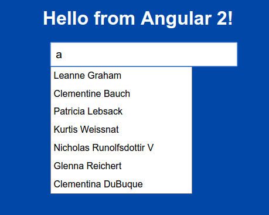
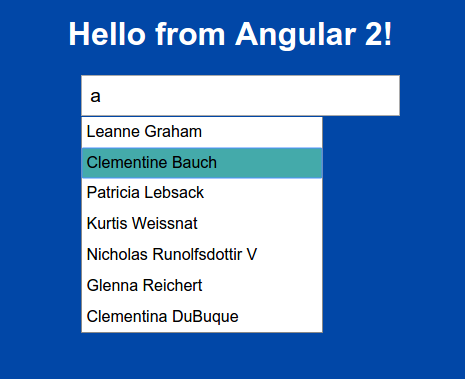
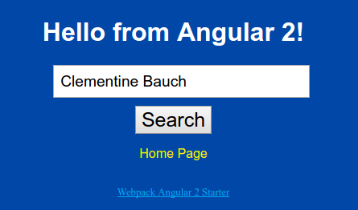

# angular2-sandbox autocompletion branch

This branch contains an autocompletion example triggered by value changes in a text control.

All source code is in the [autocompletion folder](https://github.com/cdoremus/angular2-sandbox/tree/autocompletion/autocompletion).

### Screenshots of the autcompletion component in action:

|   |   |
|---|---|
|1. Autocompletion input text box for entering search term   | 2. Text added to text box and filtered results shown   |
| |   |
| 3. Autocompletion selection is made | 4. Selected value appears in input text |
|   |   |

