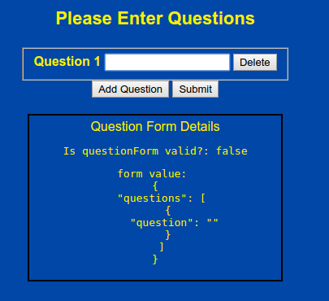
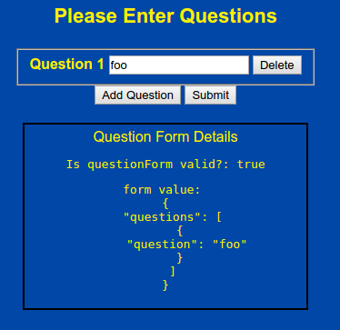
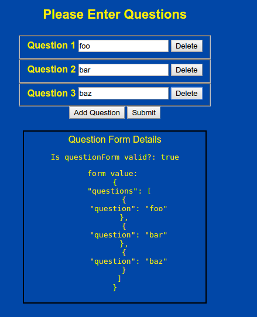
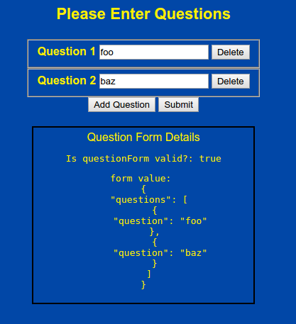

# angular2-sandbox dynamic_components branch

This branch contains a dynamic form example allowing the addition of input text components on the fly.

All source code is in the [dynamic_components](https://github.com/cdoremus/angular2-sandbox/tree/dynamic_components/dynamic_components) folder.

## Screenshots
|   |   |
|---|---|
|1. Initial invalid form (required text input)   | 2. Form valid with text box entry   |
| |   |
| 3. Three question items added | 4. Deleted the 'bar' question |
|   |   |

