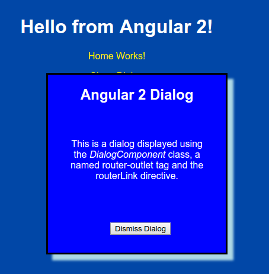

# angular2-webpack routing branch

[](https://david-dm.org/preboot/angular2-webpack#info=dependencies) [](https://david-dm.org/preboot/angular2-webpack#info=devDependencies)

This branch is designed to demonstrate routing alternatives in Angular 2.

### Auxlliary Routes

The DialogComponent is an example of a component that displays a popup dialog using an auxilliary route.

The dialog is displayed using the router-outlet element with a name attribute
and a hyperlink to show the dialog uses a specially configured routerLink directive
(see [app.component.html](https://github.com/cdoremus/angular2-sandbox/tree/routing/routing/src/app/app.component.html)).
The route is configured in [app.routing.ts](https://github.com/cdoremus/angular2-sandbox/tree/routing/routing/src/app/app.routing.ts).

#### Dialog Screenshot


### Building and Running the App

Build and run the application using the following commands:
```bash
#Install the code dependencies:
npm install

#Build and bundle the code:
npm run build

#Run unit tests:
npm test

#Start the server:
npm start

#Start the server with hot-module reloading:
npm run start:hmr
```
### Then browse to the following URL: [http://localhost:8080/](http://localhost:8080/)

#### This project is based on the [angular2-webpack-starter](https://github.com/preboot/angular2-webpack/) project

